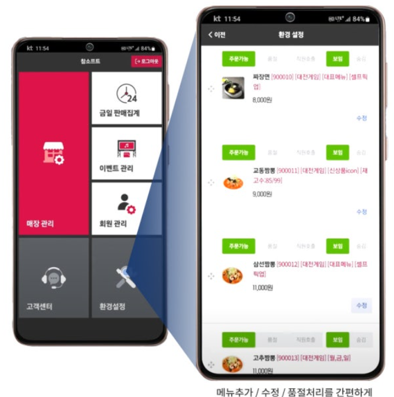
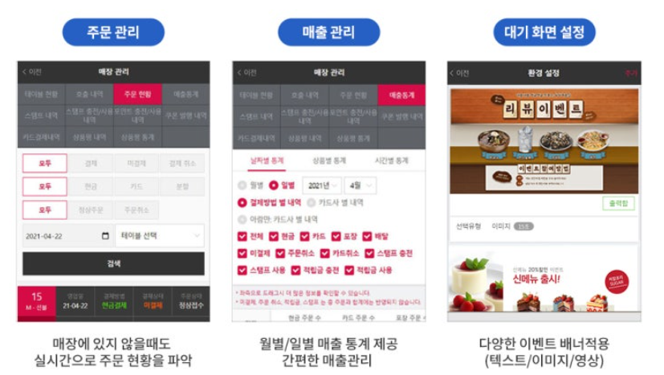

# 하이오더


#### 본 프로젝트는 하이오더의 경쟁력 향상을 위한 추가 아이디어를 MSA/DDD/Event Storming/EDA 를 포괄하는 분석/설계/구현/운영 전단계를 커버하도록 구성하였습니다.

# 아이디어 구성 배경
## 테이블오더 시장의 성장

### 장기적인 경기 침체 속에서 나날이 상승하는 인건비 절감을 위해 테이블 오더를 도입하는 자영업자들이 늘고 있습니다.


### 직원들의 업무 피로를 줄이고 매장의 운영 비효율을 해결하는 중요한 도구로써 테이블오더 같은 디지털 주문 시스템이 활용되며 테이블 오더 시장이 커지고 있습니다. 
### 한국농수산식품유통공사(aT)에 따르면 국내 음식점·주점 사업체 수는 2022년 기준 79만5488곳입니다. 통신업계에선 이 중 테이블을 10개 이상 갖춰 무인 주문 수요가 있을 만한 업체 수를 38%인 30만 곳으로 추정하고 있는 반면 한국농촌경제연구원이 집계한 외식업체의 무인주문기 사용 비율은 지난해 7.8%에 불과합니다. 이는 테이블오더 시장이 외식업에서만 지금보다 다섯 배는 더 클 수 있다는 얘기로 추후 30만 곳의 식당에 테이블오더가 보급되면 연간 약 1조원 규모의 시장이 형성될 것으로 기대하고 있습니다. 


## 테이블오더 시장의 경쟁 치열

### 얼마 전까지만 해도 스타트업과 중소기업들 중심의 시장이었지만 시장 성장성이 주목받으면서 국내 대형 통신사들과 정보기술(IT)·핀테크 기업들도 도전장을 던지며 경쟁에 합류하고 있습니다.


### 현재 테이블오더 시장은 '티오더','메뉴잇','하이오더' 등 여러 기업들이 주도하고 있으며, 그중 티오더는 약 60%의 시장 점유율로 1위를 차지하고 있습니다. 티오더는 지난해 587억 원의 매출을 기록하며 창업 이후 최대 실적을 달성했으며, 누적 설치된 태블릿 수는 20만 대에 달합니다. 월간 사용자는 약 3,500만 명입니다. KT가 테이블오더 시장 입지를 다지기 위해선 이 시장 점유율 1위인 티오더를 뛰어넘어야 합니다.

## 하이오더만의 차별점
 
### 경쟁사와 비교해보았을 때 하이오더 만의 가장 큰 특징은 관리자를 위한 "관리자용 app"을 제공한다는 점입니다. 이 앱을 통해 관리자는 보다 편하게 주문을 등록/수정/삭제 할 수 있고 주문현황 파악, 매출 관리 등이 용이합니다.



### 따라서 하이오더만의 차별화 전략인 관리자용 app에 자영업자들이 가장 어려워하는 재고관리 기능을 추가하여 하이오더만의 경쟁력을 확보하겠습니다.

## 서비스 시나리오
### 기능적 요구사항
1) 고객이 인원을 선택한다
2) 고객이 메뉴를 선택하여 주문한다
3) 고객이 결제한다
4) 주문이 되면 주문 내역이 주인한테 전달된다
5) 주인이 주문을 확인해 요리를 시작한다
6) 주인은 재고를 확인하고 주문을 취소할 수 있다 
8) 주문이 들어오면 재고가 자동으로 감소한다. 
9) 고객은 주문내역 + 상태을 확인할 수 있다
9) 주인은 메뉴를 CRUD 할 수 있다
10) 주인은 재료를 CRUD 할 수 있다
11) 주인은 admin 관리 페이지를 통해 매출 및 테이블별 주문 현황을 확인할 수 있어야한다.

### 비기능적 요구사항
1. 트랜잭션
결제가 되지 않은 주문건은 아예 거래가 성립되지 않아야 한다 (Sync 호출)

2. 장애격리
- 재고관리 기능이 수행되지 않더라도 주문은 365일 24시간 받을 수 있어야 한다 Async (event-driven), Eventual Consistency
- 결제시스템이 과중되면 사용자를 잠시동안 받지 않고 결제를 잠시후에 하도록 유도한다 Circuit breaker, fallback

3. 성능
고객이 자주 주문상태를 하이오더화면(프론트엔드)에서 확인할 수 있어야 한다 CQRS
주문상태가 바뀔때마다 화면에 알림을 줄 수 있어야 한다 Event driven

## MSA 설계
### Event Storming

### Command 및 Actor 부착

### Bounded Context 묶기

### Aggregate 묶기

### Policy 부착

### Context Mapping


## 기술스택
### Frontend

  

### Backend

   

### Database


### DevOps

       


## Jenkins Pipeline
```
pipeline {
    agent any
    tools {
        maven 'Maven 3.6.3'
        nodejs 'Node 14.x'
    }
    environment {
        REPO_URL = 'https://github.com/jaeungleee/hiorder4.git'
        BRANCH = 'main'
        DOCKER_REGISTRY = 'mjbae327'
        DOCKER_CREDENTIALS = 'docker-hub-credentials'
        KUBECONFIG = '/root/.kube/config'
    }
    stages {
        stage('Clone Repository') {
            steps {
                git branch: "${BRANCH}", url: "${REPO_URL}"
            }
        }
        stage('Build & Test Microservices') {
            steps {
                script {
                    def backendServices = ['order', 'menu', 'store', 'inventory', 'gateway']
                    for (service in backendServices) {
                        dir(service) {
                            sh 'mvn clean package'
                        }
                    }
                    
                    dir('frontend') {
                        sh 'npm install'
                        sh 'npm run build'
                    }
                }
            }
        }
        stage('Build Docker Images') {
            steps {
                script {
                    def services = ['order', 'menu', 'store', 'inventory', 'gateway', 'frontend']
                    for (service in services) {
                        dir(service) {
                            sh "docker build -t ${DOCKER_REGISTRY}/${service}:latest ."
                            
                            withCredentials([usernamePassword(credentialsId: "${DOCKER_CREDENTIALS}", passwordVariable: 'ACCESS_TOKEN', usernameVariable: 'USERNAME')]) {
                                sh "echo $ACCESS_TOKEN | docker login -u $USERNAME --password-stdin"
                                sh "docker push ${DOCKER_REGISTRY}/${service}:latest"
                            }
                        }
                    }
                }
            }
        }
        stage('Cleanup Old Resources') {
            steps {
                script {
                    def services = ['frontend', 'gateway', 'inventory', 'menu', 'order', 'store']
                    for (service in services) {
                        sh "kubectl delete deployment ${service} --ignore-not-found=true --kubeconfig=${KUBECONFIG}"
                        sh "kubectl delete service ${service} --ignore-not-found=true --kubeconfig=${KUBECONFIG}"
                    }
                }
            }
        }
        stage('Deploy to Kubernetes') {
            steps {
                script {
                    def services = ['frontend', 'gateway', 'inventory', 'menu', 'order', 'store']
                    for (service in services) {
                        dir("${service}/kubernetes") {
                            sh "kubectl apply -f deployment.yaml --kubeconfig=${KUBECONFIG}"
                            sh "kubectl apply -f service.yaml --kubeconfig=${KUBECONFIG}"
                        }
                    }
                }
            }
        }
    }
    post {
        always {
            cleanWs()
        }
        success {
            echo '배포가 성공적으로 완료되었습니다!'
        }
        failure {
            echo '배포 중 오류가 발생했습니다.'
        }
    }
}